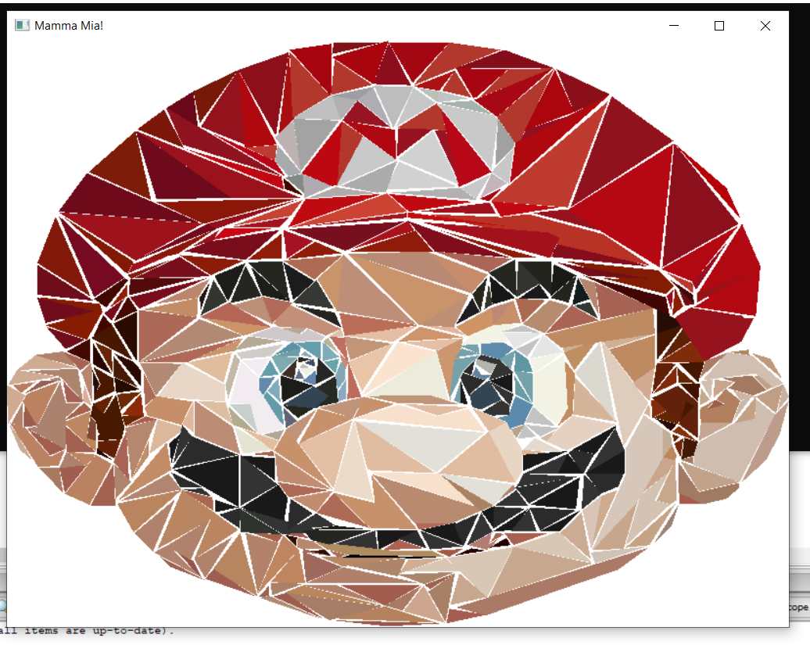

# marioOpenGL
[]

Figura de Mario hecha a base de polígonos 2D utilizando openGL y glut.

# Miembros del grupo:
- [Arribasplata, Luis](https://github.com/SaCSeBaS)
- [Esparza, Jose](https://github.com/pebeto)
- Guevara, Miguel
- [Jacobs, Bruno](https://github.com/brunojacobs1)
- [Quiroz, Johan](https://github.com/JohanQuiroz)
- [Vásquez, Mario](https://github.com/mariovasquez)
